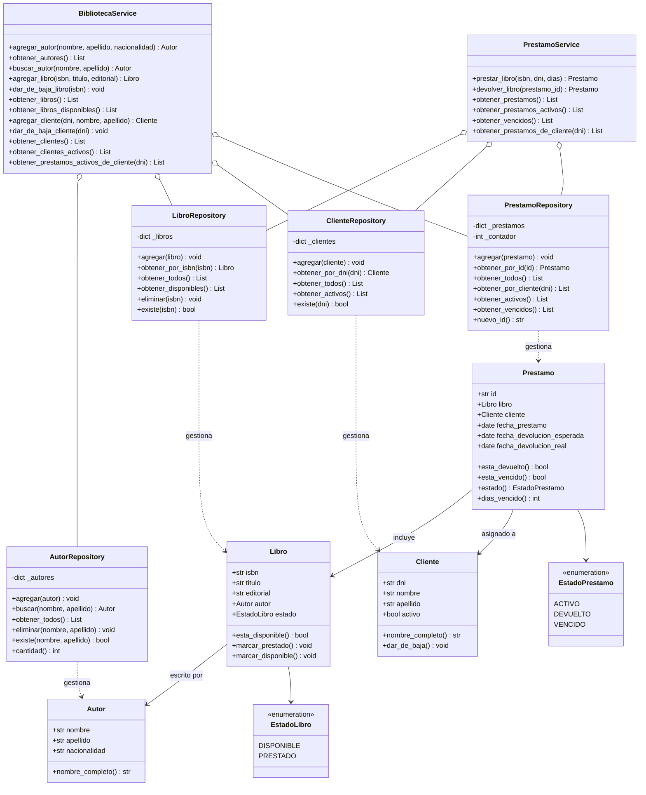
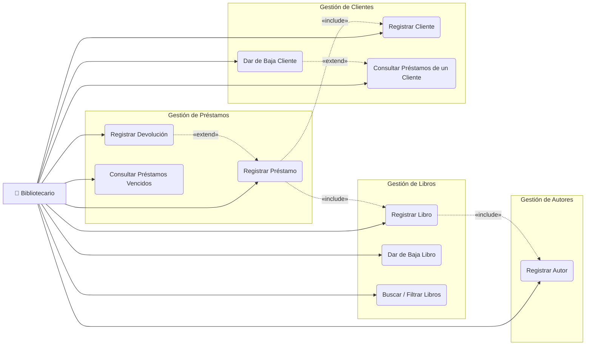
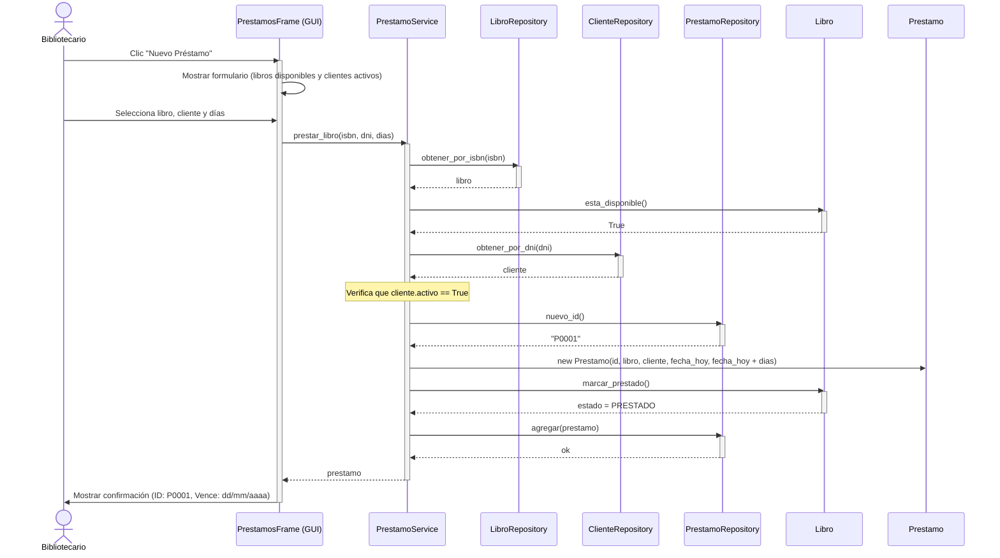
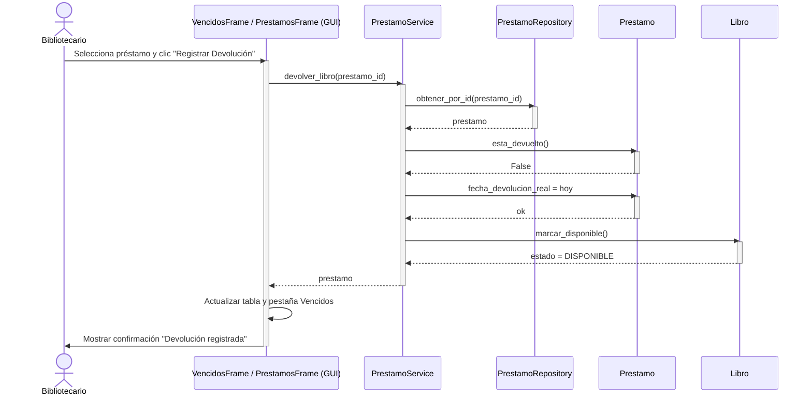

# Trabajo Práctico Final — Testeo y Prueba de Software
## Sistema de Registro de Préstamos — Biblioteca Barrial

**Institución:** Universidad de Belgrano  
**Materia:** Testeo y Prueba de Software  
**Alumno:** Abril Vera  
**Año:** 2025  

---

## Tabla de Contenidos

1. [Objetivo del Software](#1-objetivo-del-software)
2. [Requerimientos Funcionales](#2-requerimientos-funcionales)
3. [Requerimientos No Funcionales](#3-requerimientos-no-funcionales)
4. [Entidades del Sistema](#4-entidades-del-sistema)
5. [Arquitectura del Sistema](#5-arquitectura-del-sistema)
6. [Diagramas UML](#6-diagramas-uml)
   - [Diagrama de Clases](#61-diagrama-de-clases)
   - [Diagrama de Casos de Uso](#62-diagrama-de-casos-de-uso)
   - [Secuencia: Registrar Préstamo](#63-secuencia-registrar-préstamo)
   - [Secuencia: Registrar Devolución](#64-secuencia-registrar-devolución)
7. [Suite de Tests](#7-suite-de-tests)
8. [Ejecución de las Pruebas](#8-ejecución-de-las-pruebas)
   - [Plan de Ejecución](#81-plan-de-ejecución)
   - [Resultados](#82-resultados)
   - [Cobertura de Código](#83-cobertura-de-código)
9. [Pruebas End-to-End (E2E)](#10-pruebas-end-to-end-e2e)
   - [Descripción y Enfoque](#101-descripción-y-enfoque)
   - [Plan de Ejecución E2E](#102-plan-de-ejecución-e2e)
   - [Escenarios](#103-escenarios)
   - [Resultados E2E](#104-resultados)
10. [Cómo Ejecutar](#9-cómo-ejecutar)

---

## 1. Objetivo del Software

El sistema tiene como objetivo digitalizar y automatizar la gestión de préstamos de una biblioteca barrial, permitiendo registrar el ciclo completo de un préstamo: desde la incorporación de libros y lectores hasta el seguimiento de devoluciones y la detección automática de préstamos vencidos.

El sistema funciona enteramente en memoria durante la ejecución del programa, sin necesidad de base de datos externa, y expone toda su funcionalidad a través de una interfaz gráfica de usuario (GUI) desarrollada en Python con la biblioteca estándar `tkinter`.

---

## 2. Requerimientos Funcionales

| ID    | Descripción |
|-------|-------------|
| RF01  | El sistema debe permitir registrar autores con nombre, apellido y nacionalidad. |
| RF02  | El sistema debe permitir registrar libros con ISBN, título, editorial y autor asociado. |
| RF03  | El sistema debe permitir dar de baja un libro, siempre que no se encuentre prestado. |
| RF04  | El sistema debe permitir registrar clientes (lectores) con DNI, nombre y apellido. |
| RF05  | El sistema debe permitir dar de baja a un cliente, siempre que no tenga préstamos activos. |
| RF06  | El sistema debe permitir registrar un préstamo, asociando un libro disponible a un cliente activo. |
| RF07  | El sistema debe permitir registrar la devolución de un libro prestado. |
| RF08  | El sistema debe permitir consultar qué libros tiene prestados un cliente en un momento dado. |
| RF09  | El sistema debe mostrar de forma destacada la lista de préstamos vencidos (pendientes de devolución con fecha superada). |
| RF10  | El sistema debe permitir buscar y filtrar libros, clientes y préstamos por diferentes criterios. |
| RF11  | Al registrar un préstamo, el sistema debe calcular automáticamente la fecha de devolución esperada según los días configurados (por defecto 14 días). |
| RF12  | El sistema debe actualizar el estado de un libro automáticamente (Disponible / Prestado) al registrar un préstamo o una devolución. |

---

## 3. Requerimientos No Funcionales

| ID     | Descripción |
|--------|-------------|
| RNF01  | **Interfaz gráfica:** el sistema debe contar con una GUI desarrollada en `tkinter`, accesible sin conocimientos técnicos. |
| RNF02  | **Persistencia en memoria:** los datos deben mantenerse durante la ejecución del programa; al cerrar la aplicación los datos no se conservan. |
| RNF03  | **Arquitectura en capas:** el código debe estar organizado en capas separadas (Modelos, Repositorios, Servicios, GUI) para facilitar el mantenimiento y el testeo. |
| RNF04  | **Testeabilidad:** los servicios deben recibir sus dependencias por inyección (Dependency Injection), lo que permite testearlos de forma unitaria sin depender de la GUI. |
| RNF05  | **Cobertura de tests:** el sistema debe contar con una suite de tests automatizados con cobertura superior al 85% en la capa de lógica de negocio. |
| RNF06  | **Ejecutable standalone:** el sistema debe poder distribuirse como un archivo `.exe` ejecutable en Windows sin requerir instalación de Python. |
| RNF07  | **Rendimiento:** al operar en memoria, todas las operaciones deben tener tiempo de respuesta inmediato (< 100 ms). |
| RNF08  | **Portabilidad:** el sistema debe poder ejecutarse en Windows 10 y Windows 11. |

---

## 4. Entidades del Sistema

### Autor
Representa a quien escribió un libro.
- `nombre` (str): nombre del autor
- `apellido` (str): apellido del autor
- `nacionalidad` (str): nacionalidad (opcional)

### Libro
Representa un ejemplar físico de la biblioteca.
- `isbn` (str): identificador único del libro
- `titulo` (str): título del libro
- `editorial` (str): editorial que lo publicó
- `autor` (Autor): referencia al autor
- `estado` (EstadoLibro): `DISPONIBLE` o `PRESTADO`

### Cliente
Representa un lector registrado en la biblioteca.
- `dni` (str): documento nacional de identidad (identificador único)
- `nombre` (str): nombre del cliente
- `apellido` (str): apellido del cliente
- `activo` (bool): indica si el cliente está habilitado para pedir préstamos

### Préstamo
Representa la operación de préstamo de un libro a un cliente.
- `id` (str): identificador único generado automáticamente (ej: `P0001`)
- `libro` (Libro): libro prestado
- `cliente` (Cliente): cliente que lo recibe
- `fecha_prestamo` (date): fecha en que se realizó el préstamo
- `fecha_devolucion_esperada` (date): fecha límite de devolución
- `fecha_devolucion_real` (date | None): fecha efectiva de devolución (None si aún no fue devuelto)

**Estado calculado de un préstamo:**
- `ACTIVO`: no devuelto y dentro del plazo
- `VENCIDO`: no devuelto y fecha límite superada
- `DEVUELTO`: fue devuelto

---

## 5. Arquitectura del Sistema

El sistema sigue el patrón de **arquitectura en capas**:

```
┌──────────────────────────────────┐
│           GUI (tkinter)           │  ← Presentación
│  Autores │ Libros │ Clientes     │
│  Préstamos │ Vencidos            │
├──────────────────────────────────┤
│         Capa de Servicios         │  ← Lógica de negocio
│  BibliotecaService               │
│  PrestamoService                 │
├──────────────────────────────────┤
│        Capa de Repositorios       │  ← Acceso a datos
│  AutorRepo │ LibroRepo           │
│  ClienteRepo │ PrestamoRepo      │
├──────────────────────────────────┤
│           Modelos                 │  ← Entidades del dominio
│  Autor │ Libro │ Cliente         │
│  Prestamo                        │
└──────────────────────────────────┘
           (todo en memoria)
```

---

## 6. Diagramas UML

### 6.1 Diagrama de Clases



---

### 6.2 Diagrama de Casos de Uso



> Un préstamo está **vencido** cuando `fecha_devolucion_esperada < hoy` y no fue devuelto.

---

### 6.3 Secuencia: Registrar Préstamo



---

### 6.4 Secuencia: Registrar Devolución



---

## 7. Suite de Tests

El proyecto cuenta con **146 tests automatizados** organizados en tres niveles:

| Nivel | Archivos | Tests | Descripción |
|-------|----------|-------|-------------|
| Modelos | 4 archivos | 52 tests | Validación de creación, estados y reglas de negocio de cada entidad |
| Repositorios | 4 archivos | 50 tests | Operaciones CRUD, filtros y manejo de errores en cada repositorio |
| Servicios | 2 archivos | 44 tests | Casos de uso completos, incluyendo caminos felices y casos de error |

**Herramienta:** `pytest 9.0.3`  
**Comando:** `py -m pytest`

---

## 8. Ejecución de las Pruebas

### 8.1 Plan de Ejecución

#### Entorno

| Ítem | Detalle |
|------|---------|
| Sistema Operativo | Windows 11 Home |
| Lenguaje | Python 3.13.2 |
| Framework de testing | pytest 9.0.3 |
| Plugins utilizados | pytest-cov 7.1.0 |
| Fecha de ejecución | 26/05/2026 |

#### Orden de ejecución

Las suites se ejecutan en el siguiente orden, de menor a mayor nivel de integración:

```
1. test_componentes   → clases y métodos en aislamiento
2. test_integracion   → interacción entre capas con repositorios reales
3. test_caja_negra    → requerimientos funcionales RF01–RF12
4. test_rendimiento   → tiempos de respuesta bajo carga
5. test_interfaz      → contratos entre capas con mocks
6. test_camino        → cobertura de caminos independientes (McCabe)
```

#### Comando de ejecución

```
py -m pytest tests/test_componentes tests/test_integracion tests/test_caja_negra tests/test_rendimiento tests/test_interfaz tests/test_camino -v
```

Con reporte de cobertura:
```
py -m pytest tests/test_componentes tests/test_integracion tests/test_caja_negra tests/test_rendimiento tests/test_interfaz tests/test_camino --cov=src --cov-report=term-missing
```

#### Criterios de aceptación

| Criterio | Umbral |
|----------|--------|
| Tests aprobados | 100 % (0 fallos permitidos) |
| Operaciones individuales (RNF07) | < 100 ms |
| Carga masiva 1 000 registros (RNF07) | < 500 ms |
| Cobertura lógica de negocio (modelos + repos + servicios) | ≥ 85 % |

---

### 8.2 Resultados

**Ejecución:** 26/05/2026 · Python 3.13.2 · pytest 9.0.3 · Windows 11

#### Resumen por suite

| # | Suite | Archivo | Tests | Aprobados | Fallidos | Tiempo |
|---|-------|---------|------:|----------:|---------:|-------:|
| 1 | Componentes | `test_componentes.py` | 72 | 72 | 0 | — |
| 2 | Integración | `test_integracion.py` | 20 | 20 | 0 | — |
| 3 | Caja Negra | `test_caja_negra.py` | 41 | 41 | 0 | — |
| 4 | Rendimiento | `test_rendimiento.py` | 18 | 18 | 0 | — |
| 5 | Interfaz | `test_interfaz.py` | 24 | 24 | 0 | — |
| 6 | Camino | `test_camino.py` | 17 | 17 | 0 | — |
| | **TOTAL** | | **192** | **192** | **0** | **0.49 s** |

> **Resultado: APROBADO** — 192/192 tests pasando, 0 fallos.

#### Detalle por suite

**1. Prueba de Componentes (72 tests)**

Verifica cada clase y método en aislamiento total. Cubre: `Autor`, `Libro`, `Cliente`, `Prestamo`, `AutorRepository`, `LibroRepository`, `ClienteRepository`, `PrestamoRepository`.

| Clase testeada | Tests | Resultado |
|----------------|------:|-----------|
| Autor | 11 | ✅ PASS |
| Libro | 13 | ✅ PASS |
| Cliente | 9 | ✅ PASS |
| Prestamo | 12 | ✅ PASS |
| AutorRepository | 9 | ✅ PASS |
| LibroRepository | 6 | ✅ PASS |
| ClienteRepository | 4 | ✅ PASS |
| PrestamoRepository | 7 | ✅ PASS |

**2. Prueba de Integración (20 tests)**

Verifica el flujo de datos entre capas reales (Servicios → Repositorios → Modelos).

| Flujo testeado | Tests | Resultado |
|----------------|------:|-----------|
| Autor ↔ Libro | 6 | ✅ PASS |
| Cliente ↔ Préstamo | 6 | ✅ PASS |
| Ciclo completo préstamo/devolución | 7 | ✅ PASS |
| Préstamo vencido → devolución | 1 | ✅ PASS |

**3. Prueba de Caja Negra (41 tests)**

Verifica cada Requerimiento Funcional desde entradas/salidas, sin conocimiento del código interno.

| RF | Descripción | Tests | Resultado |
|----|-------------|------:|-----------|
| RF01 | Registrar autor | 4 | ✅ PASS |
| RF02 | Registrar libro | 4 | ✅ PASS |
| RF03 | Dar de baja libro | 3 | ✅ PASS |
| RF04 | Registrar cliente | 3 | ✅ PASS |
| RF05 | Dar de baja cliente | 3 | ✅ PASS |
| RF06 | Registrar préstamo | 3 | ✅ PASS |
| RF07 | Registrar devolución | 3 | ✅ PASS |
| RF08 | Préstamos de un cliente | 3 | ✅ PASS |
| RF09 | Préstamos vencidos | 3 | ✅ PASS |
| RF10 | Buscar y filtrar | 5 | ✅ PASS |
| RF11 | Fecha devolución automática | 4 | ✅ PASS |
| RF12 | Estado libro automático | 3 | ✅ PASS |

**4. Prueba de Rendimiento (18 tests)**

Verifica el cumplimiento de RNF07 (< 100 ms por operación individual, < 500 ms por carga masiva de 1 000 registros).

| Grupo | Descripción | Tests | Resultado |
|-------|-------------|------:|-----------|
| Operaciones individuales | agregar/buscar/prestar/devolver | 7 | ✅ PASS |
| Consultas con 500 registros | libros, clientes disponibles/activos | 4 | ✅ PASS |
| Carga masiva de 1 000 registros | inserción de autores, libros, clientes, préstamos | 4 | ✅ PASS |
| Filtros con 1 000 préstamos | activos, vencidos, todos | 3 | ✅ PASS |

> Todas las operaciones responden dentro del umbral definido. La carga de 1 000 registros completó en < 500 ms.

**5. Prueba de Interfaz (24 tests)**

Verifica contratos entre capas usando `unittest.mock.MagicMock`. Comprueba qué métodos se invocan, con qué argumentos y qué tipos se retornan.

| Interfaz testeada | Tests | Resultado |
|-------------------|------:|-----------|
| BibliotecaService → AutorRepository | 3 | ✅ PASS |
| BibliotecaService → LibroRepository | 5 | ✅ PASS |
| BibliotecaService → ClienteRepository | 3 | ✅ PASS |
| PrestamoService → repositorios | 9 | ✅ PASS |
| Tipos de retorno de servicios | 4 | ✅ PASS |

**6. Prueba de Camino — Basis Path Testing (17 tests)**

Verifica cada camino de ejecución independiente (McCabe) de los métodos más complejos.

| Método | V(G) | Caminos | Tests | Resultado |
|--------|-----:|--------:|------:|-----------|
| `PrestamoService.prestar_libro()` | 5 | 5 | 5 | ✅ PASS |
| `PrestamoService.devolver_libro()` | 3 | 3 | 3 | ✅ PASS |
| `BibliotecaService.dar_de_baja_libro()` | 3 | 3 | 3 | ✅ PASS |
| `BibliotecaService.dar_de_baja_cliente()` | 3 | 3 | 3 | ✅ PASS |
| `Prestamo.esta_vencido()` | 3 | 3 | 3 | ✅ PASS |
| `Prestamo.estado()` | 3 | 3 | 3 | ✅ PASS |

---

### 8.3 Cobertura de Código

Medida con `pytest-cov` sobre el paquete `src/`.

| Módulo | Líneas | Sin cubrir | Cobertura |
|--------|-------:|-----------:|----------:|
| `src/exceptions.py` | 24 | 0 | **100 %** |
| `src/models/autor.py` | 22 | 0 | **100 %** |
| `src/models/prestamo.py` | 37 | 0 | **100 %** |
| `src/models/libro.py` | 35 | 1 | **97 %** |
| `src/models/cliente.py` | 27 | 2 | **93 %** |
| `src/repositories/autor_repository.py` | 26 | 0 | **100 %** |
| `src/repositories/prestamo_repository.py` | 26 | 0 | **100 %** |
| `src/repositories/cliente_repository.py` | 20 | 1 | **95 %** |
| `src/repositories/libro_repository.py` | 25 | 1 | **96 %** |
| `src/services/biblioteca_service.py` | 67 | 0 | **100 %** |
| `src/services/prestamo_service.py` | 46 | 1 | **98 %** |
| `src/gui/` *(excluida del scope de tests)* | 721 | 721 | 0 % |

**Cobertura de la lógica de negocio** (modelos + repositorios + servicios, excluyendo GUI):

```
Líneas cubiertas:  330 / 335  →  98.5 %
```

> Supera ampliamente el umbral del 85 % establecido en RNF05.

---

## 10. Pruebas End-to-End (E2E)

### 10.1 Descripción y Enfoque

Las pruebas E2E verifican escenarios completos de uso del sistema tal como los ejecutaría un bibliotecario real. A diferencia de las pruebas unitarias o de integración, cada test E2E atraviesa **todas las capas reales** del sistema sin ningún mock:

```
Escenario de usuario
       ↓
  BibliotecaService / PrestamoService   ← punto de entrada
       ↓
  AutorRepository / LibroRepository
  ClienteRepository / PrestamoRepository
       ↓
  Autor / Libro / Cliente / Prestamo    ← estado final verificado
```

> **Nota sobre la GUI:** la automatización de ventanas Tkinter requiere un entorno gráfico activo y herramientas externas frágiles. Por eso el punto de entrada de los tests E2E es la capa de Servicios, que es exactamente lo que los frames de la GUI invocan. El comportamiento observable es idéntico.

---

### 10.2 Plan de Ejecución E2E

#### Entorno

| Ítem | Detalle |
|------|---------|
| Sistema Operativo | Windows 11 Home |
| Lenguaje | Python 3.13.2 |
| Framework | pytest 9.0.3 |
| Archivo de tests | `tests/test_e2e/test_e2e.py` |
| Fecha de ejecución | 02/06/2026 |

#### Comando de ejecución

```
py -m pytest tests/test_e2e -v
```

#### Criterios de aceptación E2E

| Criterio | Condición |
|----------|-----------|
| Todos los escenarios pasan | 100 % (0 fallos) |
| Estado del sistema consistente en cada paso | Verificado con asserts intermedios |
| Errores de negocio manejados correctamente | Excepciones específicas por caso |
| Sin efectos secundarios entre escenarios | Cada test usa un sistema limpio |

---

### 10.3 Escenarios

| ID | Escenario | Pasos clave |
|----|-----------|-------------|
| E2E-01 | Alta completa de entidades y primer préstamo | Registrar autor → libro → cliente → realizar préstamo → verificar estado en todas las capas |
| E2E-02 | Ciclo completo de préstamo, devolución y re-préstamo | Prestar a cliente 1 → devolver → prestar a cliente 2 → verificar historial |
| E2E-03 | Intento de préstamo sobre libro ya prestado | Prestar a cliente 1 → cliente 2 intenta el mismo libro → rechazo → estado intacto |
| E2E-04 | Baja de cliente bloqueada por préstamo activo | Prestar → intentar baja (rechazada) → devolver → dar de baja exitosa |
| E2E-05 | Detección y resolución de préstamos vencidos | Crear préstamo vencido → verificar listado → devolver → desaparece del listado |
| E2E-06 | Cliente con múltiples libros prestados simultáneamente | Prestar dos libros → devolver uno → verificar estado → devolver el otro → historial completo |
| E2E-07 | Integridad ante registros duplicados en toda la cadena | Intentar duplicar autor, libro, cliente y préstamo → rechazos → datos originales intactos |
| E2E-08 | Baja de libro bloqueada por préstamo activo | Prestar → intentar baja del libro (rechazada) → devolver → dar de baja exitosa |
| E2E-09 | Sistema vacío responde correctamente | Verificar que todas las consultas retornan vacío sin excepciones |

---

### 10.4 Resultados

**Ejecución:** 02/06/2026 · Python 3.13.2 · pytest 9.0.3 · Windows 11

| ID | Escenario | Tests | Resultado | Tiempo |
|----|-----------|------:|-----------|-------:|
| E2E-01 | Alta completa y primer préstamo | 5 | ✅ PASS | — |
| E2E-02 | Ciclo préstamo, devolución y re-préstamo | 5 | ✅ PASS | — |
| E2E-03 | Préstamo sobre libro ya prestado | 2 | ✅ PASS | — |
| E2E-04 | Baja de cliente bloqueada → devolver → dar de baja | 2 | ✅ PASS | — |
| E2E-05 | Préstamos vencidos | 5 | ✅ PASS | — |
| E2E-06 | Cliente con múltiples libros | 1 | ✅ PASS | — |
| E2E-07 | Integridad ante duplicados | 4 | ✅ PASS | — |
| E2E-08 | Baja de libro bloqueada → devolver → dar de baja | 1 | ✅ PASS | — |
| E2E-09 | Sistema vacío | 2 | ✅ PASS | — |
| | **TOTAL** | **27** | **27/27 ✅** | **0.20 s** |

> **Resultado: APROBADO** — 27/27 escenarios E2E pasando, 0 fallos.

#### Observaciones

- Cada test parte de un sistema completamente limpio (fixture `sistema` crea nuevas instancias de todos los repositorios).
- Los tests con préstamos vencidos usan inserción directa en el repositorio para simular el paso del tiempo sin depender del reloj real.
- El E2E-06 verifica la consistencia del estado en **cada paso** del flujo, no solo al final, garantizando que no hay estados intermedios corruptos.
- El E2E-07 verifica que los rechazos no alteran los datos existentes (los originales permanecen intactos tras cada intento fallido).

---

## 9. Cómo Ejecutar

**Aplicación gráfica:**
```
py main.py
```

**Tests:**
```
py -m pytest
py -m pytest --cov=src --cov-report=term-missing
```

**Ejecutable (sin Python instalado):**
```
dist/BibliotecaBarrial.exe
```
