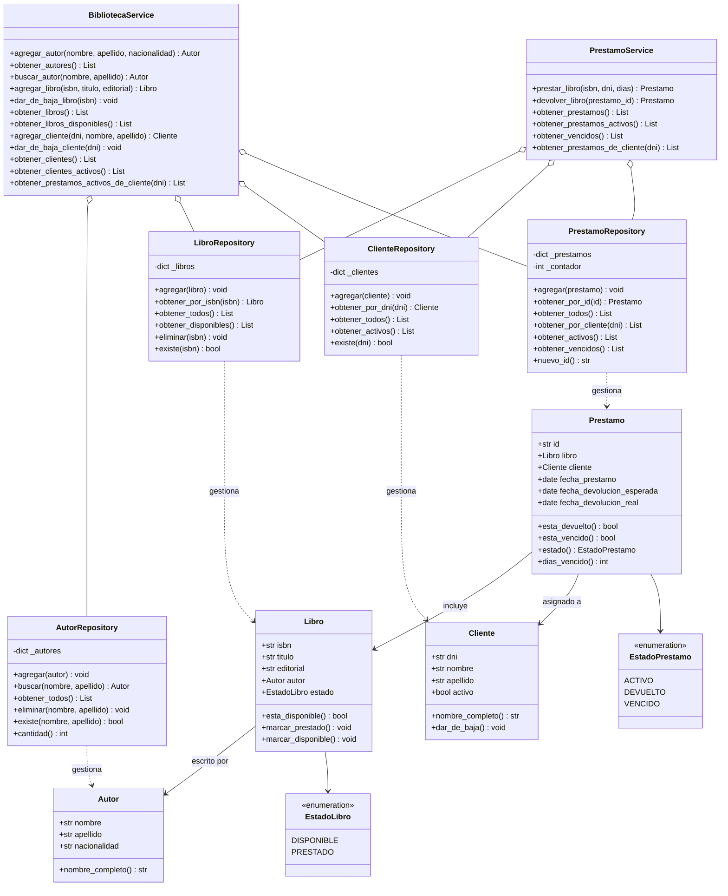
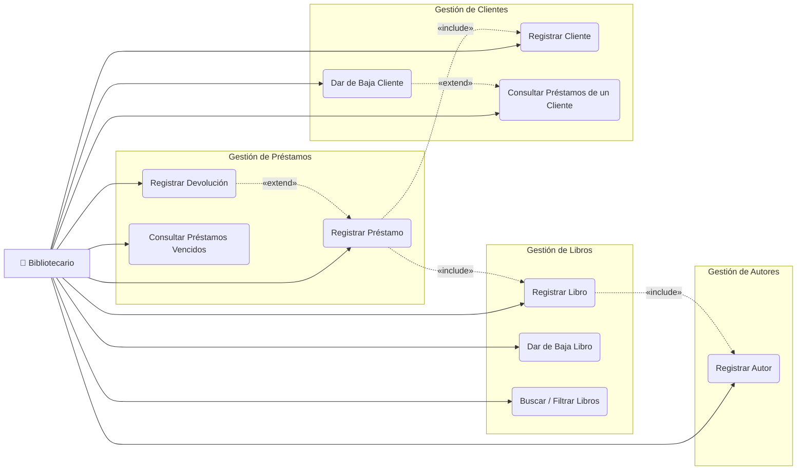
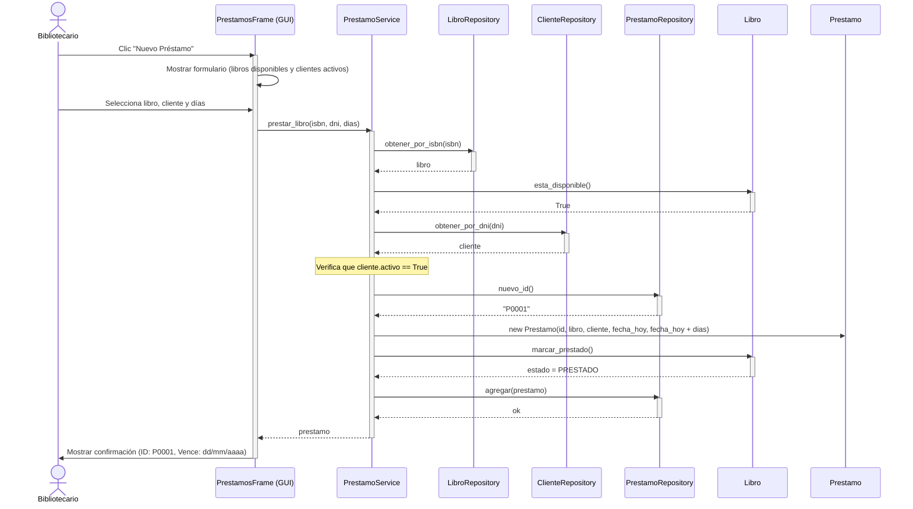
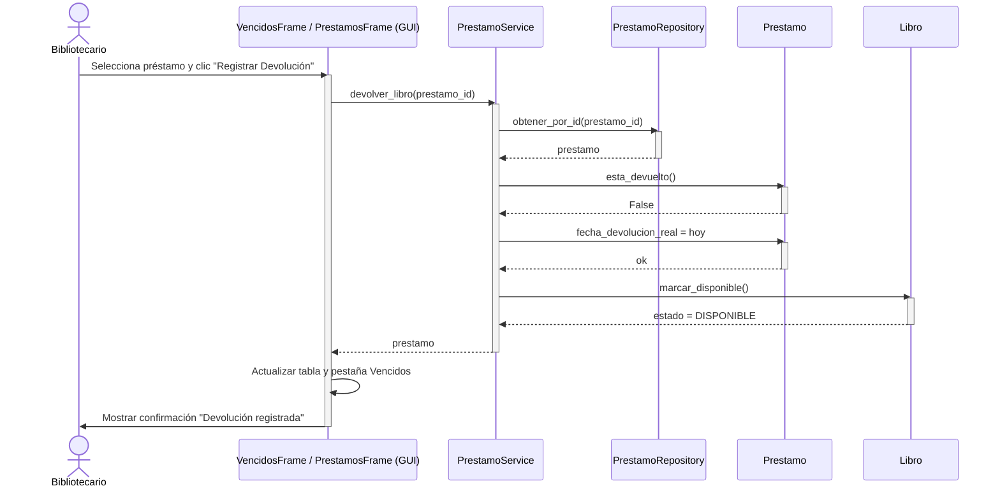

# Trabajo Práctico Final — Testeo y Prueba de Software
## Sistema de Registro de Préstamos — Biblioteca Barrial

**Institución:** Universidad de Belgrano  
**Materia:** Testeo y Prueba de Software  
**Alumno:** Abril Vera  
**Año:** 2025  

---

## Tabla de Contenidos

1. [Objetivo del Software](#1-objetivo-del-software)
2. [Requerimientos Funcionales](#2-requerimientos-funcionales)
3. [Requerimientos No Funcionales](#3-requerimientos-no-funcionales)
4. [Entidades del Sistema](#4-entidades-del-sistema)
5. [Arquitectura del Sistema](#5-arquitectura-del-sistema)
6. [Diagramas UML](#6-diagramas-uml)
   - [Diagrama de Clases](#61-diagrama-de-clases)
   - [Diagrama de Casos de Uso](#62-diagrama-de-casos-de-uso)
   - [Secuencia: Registrar Préstamo](#63-secuencia-registrar-préstamo)
   - [Secuencia: Registrar Devolución](#64-secuencia-registrar-devolución)
7. [Suite de Tests](#7-suite-de-tests)
8. [Cómo Ejecutar](#8-cómo-ejecutar)

---

## 1. Objetivo del Software

El sistema tiene como objetivo digitalizar y automatizar la gestión de préstamos de una biblioteca barrial, permitiendo registrar el ciclo completo de un préstamo: desde la incorporación de libros y lectores hasta el seguimiento de devoluciones y la detección automática de préstamos vencidos.

El sistema funciona enteramente en memoria durante la ejecución del programa, sin necesidad de base de datos externa, y expone toda su funcionalidad a través de una interfaz gráfica de usuario (GUI) desarrollada en Python con la biblioteca estándar `tkinter`.

---

## 2. Requerimientos Funcionales

| ID    | Descripción |
|-------|-------------|
| RF01  | El sistema debe permitir registrar autores con nombre, apellido y nacionalidad. |
| RF02  | El sistema debe permitir registrar libros con ISBN, título, editorial y autor asociado. |
| RF03  | El sistema debe permitir dar de baja un libro, siempre que no se encuentre prestado. |
| RF04  | El sistema debe permitir registrar clientes (lectores) con DNI, nombre y apellido. |
| RF05  | El sistema debe permitir dar de baja a un cliente, siempre que no tenga préstamos activos. |
| RF06  | El sistema debe permitir registrar un préstamo, asociando un libro disponible a un cliente activo. |
| RF07  | El sistema debe permitir registrar la devolución de un libro prestado. |
| RF08  | El sistema debe permitir consultar qué libros tiene prestados un cliente en un momento dado. |
| RF09  | El sistema debe mostrar de forma destacada la lista de préstamos vencidos (pendientes de devolución con fecha superada). |
| RF10  | El sistema debe permitir buscar y filtrar libros, clientes y préstamos por diferentes criterios. |
| RF11  | Al registrar un préstamo, el sistema debe calcular automáticamente la fecha de devolución esperada según los días configurados (por defecto 14 días). |
| RF12  | El sistema debe actualizar el estado de un libro automáticamente (Disponible / Prestado) al registrar un préstamo o una devolución. |

---

## 3. Requerimientos No Funcionales

| ID     | Descripción |
|--------|-------------|
| RNF01  | **Interfaz gráfica:** el sistema debe contar con una GUI desarrollada en `tkinter`, accesible sin conocimientos técnicos. |
| RNF02  | **Persistencia en memoria:** los datos deben mantenerse durante la ejecución del programa; al cerrar la aplicación los datos no se conservan. |
| RNF03  | **Arquitectura en capas:** el código debe estar organizado en capas separadas (Modelos, Repositorios, Servicios, GUI) para facilitar el mantenimiento y el testeo. |
| RNF04  | **Testeabilidad:** los servicios deben recibir sus dependencias por inyección (Dependency Injection), lo que permite testearlos de forma unitaria sin depender de la GUI. |
| RNF05  | **Cobertura de tests:** el sistema debe contar con una suite de tests automatizados con cobertura superior al 85% en la capa de lógica de negocio. |
| RNF06  | **Ejecutable standalone:** el sistema debe poder distribuirse como un archivo `.exe` ejecutable en Windows sin requerir instalación de Python. |
| RNF07  | **Rendimiento:** al operar en memoria, todas las operaciones deben tener tiempo de respuesta inmediato (< 100 ms). |
| RNF08  | **Portabilidad:** el sistema debe poder ejecutarse en Windows 10 y Windows 11. |

---

## 4. Entidades del Sistema

### Autor
Representa a quien escribió un libro.
- `nombre` (str): nombre del autor
- `apellido` (str): apellido del autor
- `nacionalidad` (str): nacionalidad (opcional)

### Libro
Representa un ejemplar físico de la biblioteca.
- `isbn` (str): identificador único del libro
- `titulo` (str): título del libro
- `editorial` (str): editorial que lo publicó
- `autor` (Autor): referencia al autor
- `estado` (EstadoLibro): `DISPONIBLE` o `PRESTADO`

### Cliente
Representa un lector registrado en la biblioteca.
- `dni` (str): documento nacional de identidad (identificador único)
- `nombre` (str): nombre del cliente
- `apellido` (str): apellido del cliente
- `activo` (bool): indica si el cliente está habilitado para pedir préstamos

### Préstamo
Representa la operación de préstamo de un libro a un cliente.
- `id` (str): identificador único generado automáticamente (ej: `P0001`)
- `libro` (Libro): libro prestado
- `cliente` (Cliente): cliente que lo recibe
- `fecha_prestamo` (date): fecha en que se realizó el préstamo
- `fecha_devolucion_esperada` (date): fecha límite de devolución
- `fecha_devolucion_real` (date | None): fecha efectiva de devolución (None si aún no fue devuelto)

**Estado calculado de un préstamo:**
- `ACTIVO`: no devuelto y dentro del plazo
- `VENCIDO`: no devuelto y fecha límite superada
- `DEVUELTO`: fue devuelto

---

## 5. Arquitectura del Sistema

El sistema sigue el patrón de **arquitectura en capas**:

```
┌──────────────────────────────────┐
│           GUI (tkinter)           │  ← Presentación
│  Autores │ Libros │ Clientes     │
│  Préstamos │ Vencidos            │
├──────────────────────────────────┤
│         Capa de Servicios         │  ← Lógica de negocio
│  BibliotecaService               │
│  PrestamoService                 │
├──────────────────────────────────┤
│        Capa de Repositorios       │  ← Acceso a datos
│  AutorRepo │ LibroRepo           │
│  ClienteRepo │ PrestamoRepo      │
├──────────────────────────────────┤
│           Modelos                 │  ← Entidades del dominio
│  Autor │ Libro │ Cliente         │
│  Prestamo                        │
└──────────────────────────────────┘
           (todo en memoria)
```

---

## 6. Diagramas UML

### 6.1 Diagrama de Clases



---

### 6.2 Diagrama de Casos de Uso



> Un préstamo está **vencido** cuando `fecha_devolucion_esperada < hoy` y no fue devuelto.

---

### 6.3 Secuencia: Registrar Préstamo



---

### 6.4 Secuencia: Registrar Devolución



---

## 7. Suite de Tests

El proyecto cuenta con **146 tests automatizados** organizados en tres niveles:

| Nivel | Archivos | Tests | Descripción |
|-------|----------|-------|-------------|
| Modelos | 4 archivos | 52 tests | Validación de creación, estados y reglas de negocio de cada entidad |
| Repositorios | 4 archivos | 50 tests | Operaciones CRUD, filtros y manejo de errores en cada repositorio |
| Servicios | 2 archivos | 44 tests | Casos de uso completos, incluyendo caminos felices y casos de error |

**Herramienta:** `pytest 9.0.3`  
**Comando:** `py -m pytest`

---

## 8. Cómo Ejecutar

**Aplicación gráfica:**
```
py main.py
```

**Tests:**
```
py -m pytest
py -m pytest --cov=src --cov-report=term-missing
```

**Ejecutable (sin Python instalado):**
```
dist/BibliotecaBarrial.exe
```
